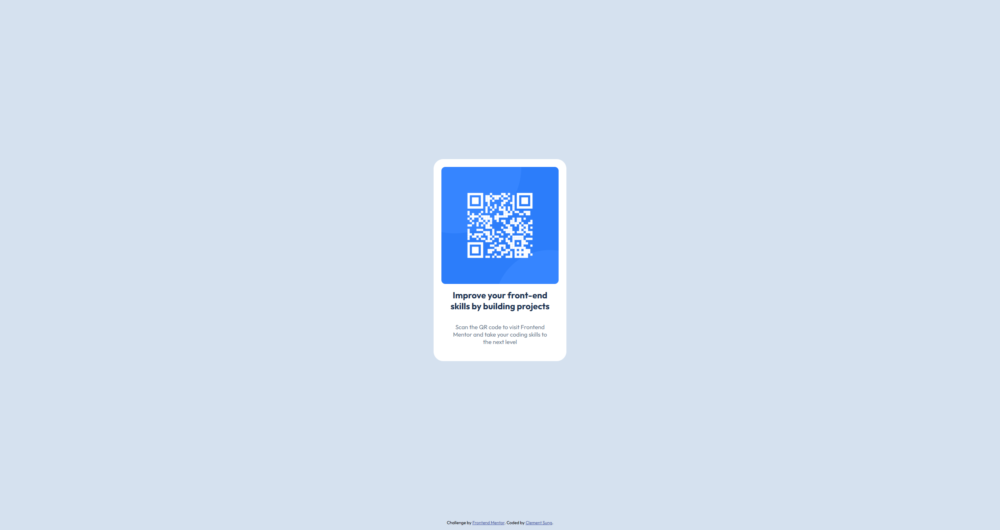

# Frontend Mentor - QR code component solution

This is a solution to the [QR code component challenge on Frontend Mentor](https://www.frontendmentor.io/challenges/qr-code-component-iux_sIO_H). Frontend Mentor challenges help you improve your coding skills by building realistic projects. 

## Table of contents

- [Overview](#overview)
  - [Screenshot](#screenshot)
  - [Links](#links)
- [My process](#my-process)
  - [Built with](#built-with)
  - [What I learned](#what-i-learned)
  - [Continued development](#continued-development)
  - [Useful resources](#useful-resources)
- [Author](#author)
- [Acknowledgments](#acknowledgments)


## Overview

### Screenshot




### Links

- Solution URL: [solution URL](https://your-solution-url.com)
- Live Site URL: [qr-code-component](https://clembrulee.github.io/qr-code-component/)

## My process

### Built with

- Semantic HTML5 markup
- CSS custom properties
- Flexbox
- CSS Grid

### What I learned

I set the QR code image to a fixed width and then stylized the container around it. I aligned the items with flexbox. 

```css
.container {
  width: 300px;
  height: auto;
  display: flex;
  justify-content: center;
  align-items: center;
  flex-direction: column;
  margin: 30vh auto;
  background-color: #fff;
  border-radius: 25px;
  padding: 20px;
}
```
```js
const proudOfThisFunc = () => {
  console.log('🎉')
}
```

If you want more help with writing markdown, we'd recommend checking out [The Markdown Guide](https://www.markdownguide.org/) to learn more.


### Continued development

Through this challenge, I identified that I need to refine my CSS positioning techniques.

### Useful resources


## Author

- Website - [Clement Sung](https://www.clementsung.com)
- Frontend Mentor - [@clembrulee](https://www.frontendmentor.io/profile/clembrulee)


## Acknowledgments

This is where you can give a hat tip to anyone who helped you out on this project. Perhaps you worked in a team or got some inspiration from someone else's solution. This is the perfect place to give them some credit.